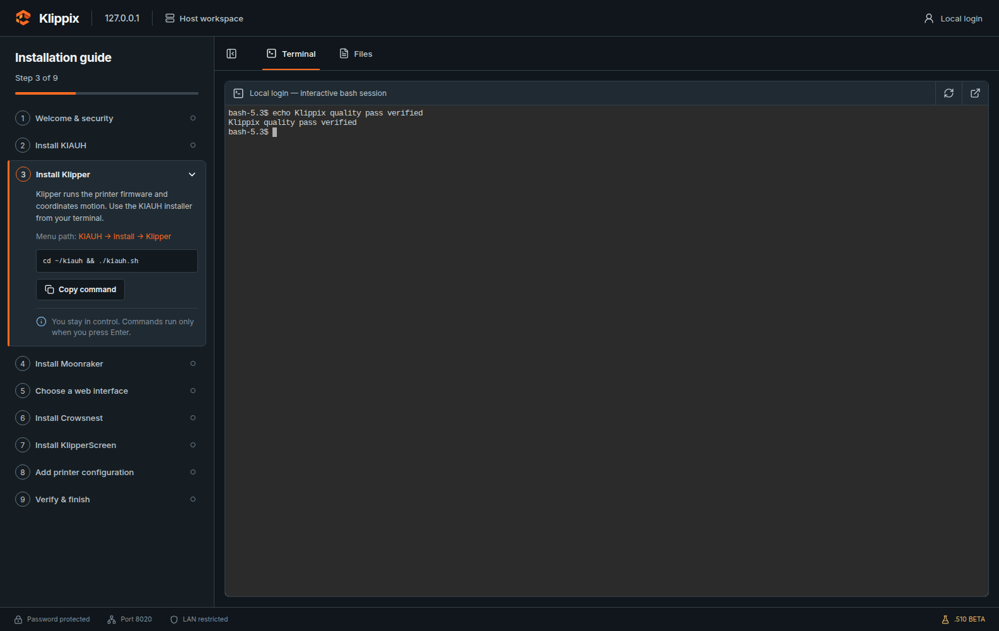
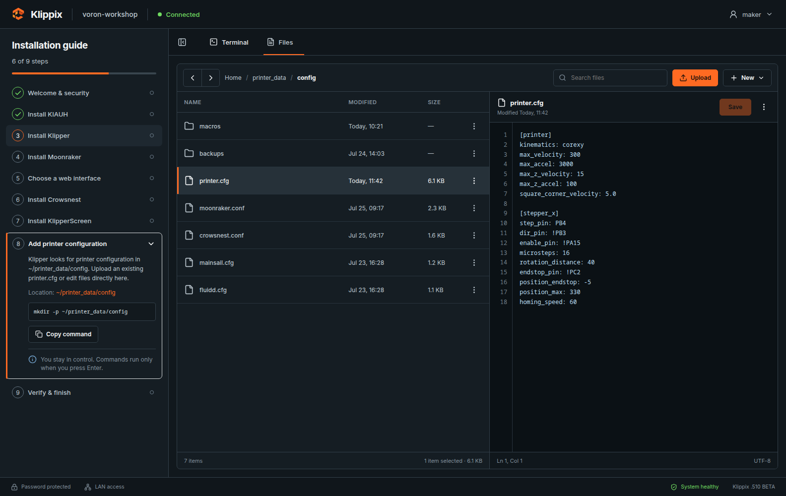

# Klippix

> **Klippix .510 BETA**

Klippix is a browser-based setup workspace for Debian-family Klipper hosts. The
current beta contains the first interactive GUI and package installer:

## GUI preview





- A guided KIAUH installation checklist
- An authenticated browser terminal backed by a local `/bin/login` session
- A printer configuration file manager and editor
- Responsive desktop and mobile layouts

The packaged terminal connects to the LAN-only ttyd service. The filesystem
still uses sample in-browser data; a later restricted API will connect it to
printer configuration files.

## Clone the repository

Clone Klippix over HTTPS and enter the project directory:

```bash
git clone https://github.com/captainkearn/Klippix.git
cd Klippix
```

Because the repository is currently private, GitHub will require an account
with access and authenticated Git credentials.

## Development

```bash
npm install
npm run dev
```

Open the local URL printed by Vite.

The development and preview servers listen on port `8020` and reject HTTP
requests whose peer address is not loopback or a private/link-local address.
Production deployment uses the Nginx and nftables configurations under
[`deploy`](./deploy).

From another machine on the LAN, use `http://<device-address>:8020` or
`http://<hostname>.local:8020`.

## Checks

```bash
npm run lint
npm test
npm run build
```

Visual concepts are stored in [`docs/design`](./docs/design).
The planned host services, packages, ports, and security boundaries are
documented in [`docs/ARCHITECTURE.md`](./docs/ARCHITECTURE.md).

## Build and install the Debian package

Build an architecture-specific package in a clean Debian container:

```bash
scripts/build-deb.sh amd64
scripts/build-deb.sh arm64
scripts/build-deb.sh armhf
```

Install a local build on a supported Debian-family host:

```bash
sudo installer/install.sh --deb 'artifacts/klippix_0.510~beta1_amd64.deb'
```

Use the package matching `dpkg --print-architecture`: `amd64` for x86-64,
`arm64` for 64-bit Raspberry Pi/Armbian, or `armhf` for 32-bit ARM.

The installer uses `apt` to resolve every declared dependency, validates the
services and firewall, and prints the URL and initial web credential. It does
not install KIAUH or printer services automatically; log in through the
Terminal tab and follow the guide to make those choices interactively.
